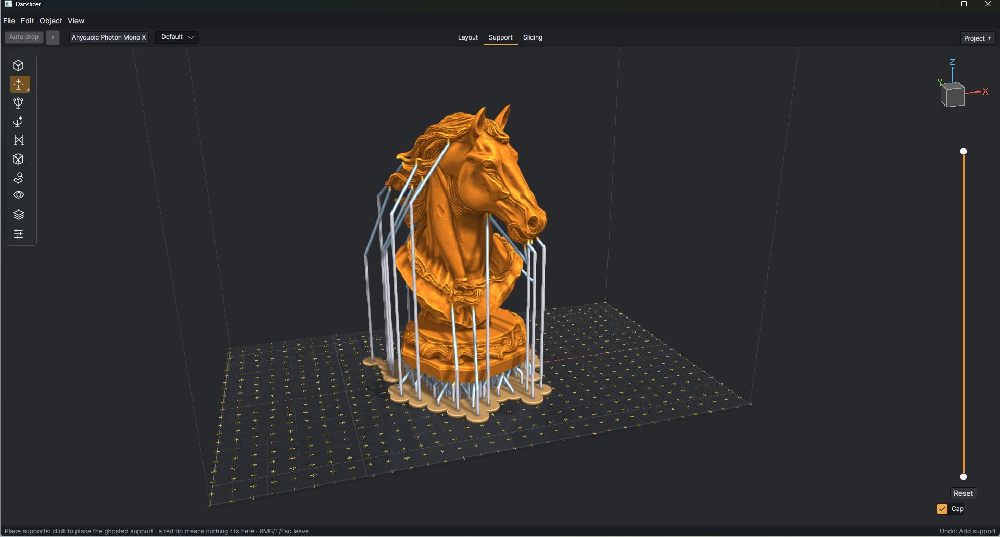

# Danslicer

**Prepare, support, and slice models for resin 3D printing.**

Danslicer is a desktop resin slicer with a 3D workspace, automatic and hand-placed supports, editable support structures, and native printer-file export. It also includes a command-line tool for slicing and mesh analysis. **[Download the latest release](https://github.com/danilius/Danslicer/releases/latest)** to get started without building from source.

[Download](https://github.com/danilius/Danslicer/releases/latest) · [User guide](docs/wiki/Home.md) · [GitHub Wiki](https://github.com/danilius/Danslicer/wiki) · [Keyboard shortcuts](docs/wiki/Keyboard-shortcuts.md) · [Report an issue](https://github.com/danilius/Danslicer/issues)



Horse model: [Horse Bust 2 by Ninomalbinho](https://www.printables.com/model/1529173-horse-bust-2).

## From model to print

1. **Layout** — import STL or OBJ models, move, rotate, scale, duplicate, mirror, and place them on the build plate.
2. **Support** — generate supports, paint support and keep-clean regions, detect islands, or place contacts with line, polygon, edge, ring, and contour tools.
3. **Structure** — parent contacts into Candelabra, Tree, or Simple structures, add bracing, edit individual supports, and build plate or web rafts.
4. **Slicing** — choose a printer and resin, inspect individual layers, check estimates, and export the printer's native format.

Projects save as `.danslicer` files so you can return to your scene and settings.

## Start here

- [Getting started](docs/wiki/Getting-started.md): download, launch, and make your first slice.
- [Layout and projects](docs/wiki/Layout-and-projects.md): object editing and project files.
- [Support settings](docs/wiki/Support-settings.md): what each contact, member, base, and placement setting does.
- [Manual and guided supports](docs/wiki/Manual-and-guided-supports.md): hands-on placement and editing.
- [Printers, resins, and slicing](docs/wiki/Printers-resins-and-slicing.md): profiles, exposure, peel motion, preview, and export.
- [Complete guide](docs/wiki/Home.md): all topics, including regions, islands, structure, rafts, preferences, and CLI usage.

## Download and run

**[v1.0.0 — Build 1](https://github.com/danilius/Danslicer/releases/tag/v1.0.0)** is a portable Windows x64 release. Download `Danslicer-build-1-win-x64.zip`, extract the entire archive, and run **Danslicer.App.exe**. Keep the extracted files together. No installer or separate .NET installation is required.

Use the Windows ZIP under **Assets**; GitHub's **Source code** archives are for developers. The release also includes SHA-256 checksums.

## Build from source

Install the .NET 10 SDK, then run these commands from the repository root:

```powershell
dotnet build src/Danslicer.App/Danslicer.App.csproj -c Debug
dotnet run --project src/Danslicer.App/Danslicer.App.csproj -c Debug --no-build
```

The default Debug output is `src/Danslicer.App/bin/Debug/net10.0`.

```powershell
dotnet test tests/Danslicer.Tests/Danslicer.Tests.csproj -c Debug
dotnet run --project src/Danslicer.Cli/Danslicer.Cli.csproj -- printers
```

Self-contained publishing targets Windows x64, Linux x64, and macOS ARM64. See [cross-platform builds](docs/CROSS-PLATFORM-BUILDS.md). Cross-publishing does not establish that a bundle has been tested on its target hardware. SpaceMouse input is Windows-only.

## Printer compatibility

Native writers cover Photon Workshop, GOO, CTB, PHZ, Creality, and several archive and legacy formats. The selected profile determines the exact extension and format version; changing a filename extension does not convert a print file.

**Compatibility is still being validated.** The Mono X profile records a user-confirmed mirror orientation. Other profiles are marked experimental with physical printing unverified. See [printer compatibility and export limitations](docs/wiki/Printer-compatibility.md) before choosing a profile.

## Development and documentation

| Directory | Contents |
| --- | --- |
| `src/Danslicer.App` | Avalonia desktop interface |
| `src/Danslicer.Core` | Geometry, project data, support generation, slicing, and file formats |
| `src/Danslicer.Render` | OpenGL viewport renderer |
| `src/Danslicer.Cli` | Command-line interface |
| `tests` | Automated tests and format audit tools |
| `docs/wiki` | Versioned user-guide pages and images |

When reporting a problem, include the build or commit, printer profile, steps to reproduce, and a small sample project if you can share one. Documentation follows the September 2026 source; recent development features are identified in the relevant pages.
