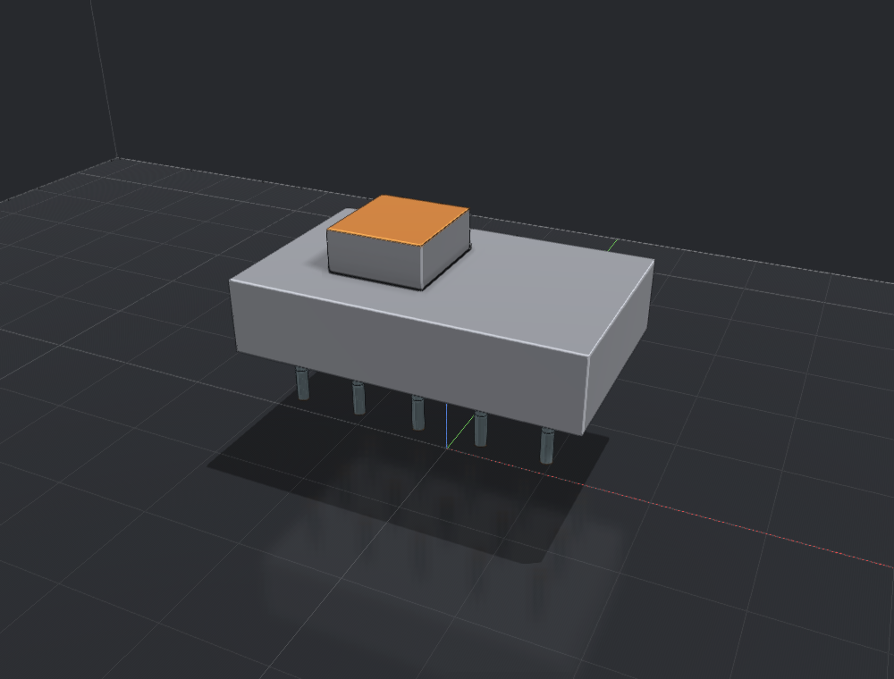

# Danslicer user guide

Danslicer prepares models for resin printing in three workspaces: **Layout**, **Support**, and **Slicing**. Start with a model, arrange it on the plate, add supports, then inspect and export its layers. **[Download the latest release](https://github.com/danilius/Danslicer/releases/latest)** to get started: **[v1.0.0 — Build 1](https://github.com/danilius/Danslicer/releases/tag/v1.0.0)** provides a portable Windows x64 app with no installer or separate .NET installation required. See [Getting started](Getting-started.md) for download and launch instructions.

## Learn the workflow

| Page | What you will find |
| --- | --- |
| [Getting started](Getting-started.md) | Download or build, launch, and follow the first model-to-print workflow |
| [Layout and projects](Layout-and-projects.md) | Import, save, reload, select, transform, duplicate, mirror, and place objects |
| [Navigation and visibility](Navigation-and-visibility.md) | Camera, view cube, support display, isolation, and selection through models |
| [Support settings](Support-settings.md) | Presets and every exposed contact, member, base, grid, reinforcement, and generation setting |
| [Manual and guided supports](Manual-and-guided-supports.md) | Single contacts, lines, polygons, edges, rings, contours, densify, thin, and editing |
| [Regions and islands](Regions-and-islands.md) | Paint support or keep-clean areas and find unsupported islands |
| [Parenting and bracing](Parenting-and-bracing.md) | Structure previews, grouping contacts, automatic and manual braces |
| [Rafts](Rafts.md) | Plate and web rafts, dimensions, and scraper lips |
| [Printers, resins, and slicing](Printers-resins-and-slicing.md) | Printer editor, resin recipes, print settings, layers, estimates, and UVtools |
| [Printer compatibility](Printer-compatibility.md) | Native formats and their limits |
| [Preferences](Preferences.md) | Appearance, rendering, keymap, external tools, and SpaceMouse |
| [Keyboard shortcuts](Keyboard-shortcuts.md) | Application shortcuts, mode-specific keys, and mouse gestures |
| [Command line](Command-line.md) | Slicing, inspection, checks, tips, routing, and benchmarks |
| [Troubleshooting](Troubleshooting.md) | Common causes of unavailable commands, missing supports, and export problems |

## Conventions

- Lengths are **millimetres**, angles **degrees**, exposure/delay **seconds**, and peel speeds **mm/min**, unless a field explicitly says otherwise.
- A **tip/contact** touches the model; a **branch** connects it to a **trunk**; a **base** anchors a trunk to the plate. **Parenting** reorganizes those connections. **Bracing** joins neighbouring support members.
- Shortcuts assume the default keymap and focus in the viewport. Text editors and active tools consume keys differently.
- Screenshots are existing September 2026 UI/renderer captures. They illustrate controls and sample geometry; example values are not calibrated print recipes. Some UI captures omit the GPU-rendered model.
- The guide describes the September 15 source. Release v1.0.0 Build 1 includes manual braces and structure previews; older builds may differ.

The Markdown source and images also live in the main repository under `docs/wiki`.
