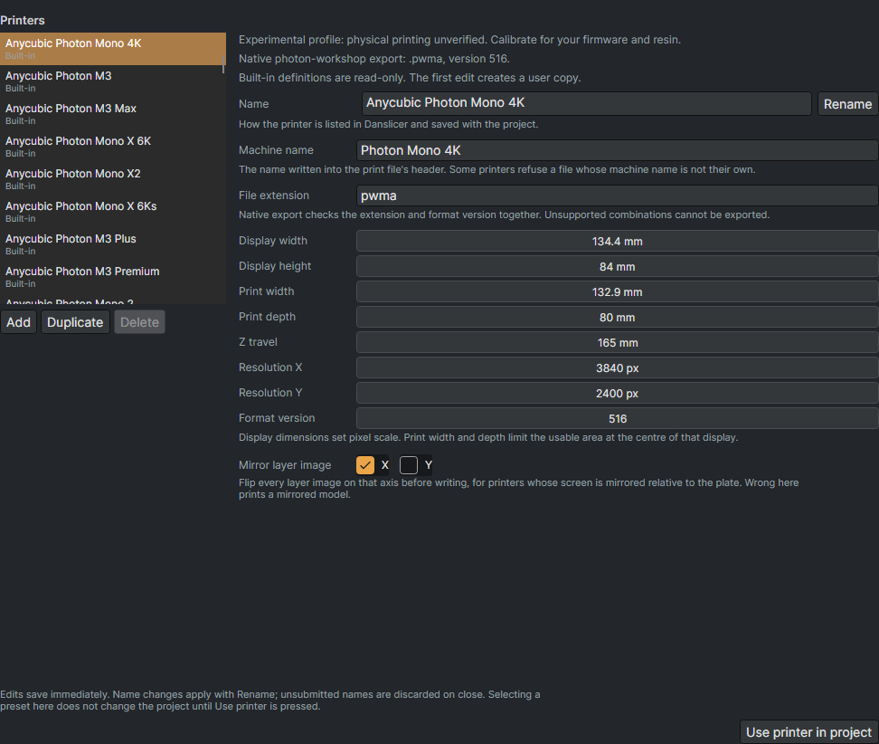
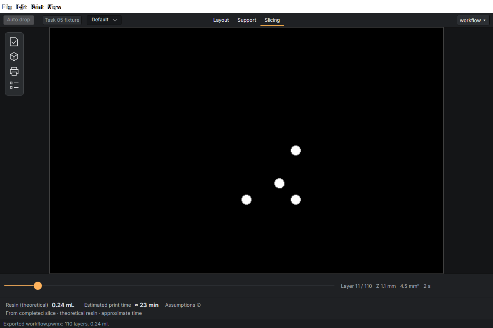

# Printers, resins, and slicing

Open **Print settings** for the current printer, resin recipe, and per-print settings. Switch to **Slicing** to slice, inspect, and export.

## Printer presets

Use **Edit presets…** to open the printer editor. **Add**, **Duplicate**, **Rename**, and **Delete** manage profiles. Built-in profiles are read-only; the first edit creates a user copy. Edits save immediately, but choosing a preset in the editor does not change the current project until **Use printer in project** is pressed.

| Field | Meaning |
| --- | --- |
| Name | Label used in Danslicer and saved with the project. Confirm name edits with Rename. |
| Machine name | Printer identity written into the file header. Some firmware requires its exact name. |
| File extension | Native output suffix. Must match the selected writer and version. |
| Display width / height | Physical screen size in mm; together with resolution, determines pixel size. |
| Print width / depth | Centred usable build area inside the display. These do not change pixel scale. |
| Z travel | Maximum printable height in mm. |
| Resolution X / Y | Screen pixel counts. |
| Format version | File format version, not the app version. Unsupported combinations block export. |
| Mirror layer image X / Y | Flip raster output for the printer's screen orientation. This differs from mirroring a scene object. |

Consult [Printer compatibility](Printer-compatibility.md) for physical validation and format-specific limitations.

## Resin recipes

**Save** updates a recipe; **Save As…**, **Rename**, and **Delete** manage recipes. Applying a resin changes cure and peel settings only. Layer height, anti-aliasing, and XY compensation remain per-print choices.

| Setting | Unit; initial value | What it does |
| --- | --- | --- |
| Bottom layers | count; 5 | Number of initial layers using bottom exposure and bottom lift values. |
| Bottom exposure | s; 30 | Cure time for each bottom layer. |
| Exposure | s; 2 | Cure time for normal layers. |
| Light-off delay | s; 2.5 | Wait before cure. |
| Lift height | mm; 8 | Normal-layer separation distance. |
| Lift speed | mm/min; 120 | Normal-layer upward peel speed. |
| Retract speed | mm/min; 180 | Return speed after lifting. |
| Bottom lift height | mm; 8 | Lift distance for bottom layers. |
| Bottom lift speed | mm/min; 120 | Lift speed for bottom layers. |

The initial values are software defaults. Use a recipe calibrated for the printer and resin. Firmware-controlled peel formats may ignore motion fields.

## Per-print settings

| Setting | Initial value | Effect |
| --- | --- | --- |
| Layer height | 0.05 mm | Z distance between slices; smaller values produce more layers. |
| Anti-aliasing | On | Smooth raster contour edges with grayscale. Actual levels depend on the output format. |
| XY compensation | 0 mm | Offset every layer contour. Negative shrinks; positive expands. Used to compensate for dimensional error/light bleed. |

Viewport **FXAA** is independent of layer anti-aliasing and does not change the print.

## Slice, inspect, export

1. Click **Slice** or press `Ctrl+R` in Slicing. Review bounds warnings and any failure message.
2. Move the horizontal layer slider to inspect masks. The readout reports layer number, Z, area, and exposure. Check the first appearances of islands and the raft/support connection layers.
3. Read the resin and print-time estimates. They are estimates: theoretical resin is derived from slice material, and time does not include all firmware acceleration, overhead, or handling losses. The assumptions control explains the estimate.
4. Click **Export…** (`Ctrl+E`) and use the required extension. Geometry or settings changes can make an old slice stale; reslice before export.
5. Optionally use **UV check** to open the exported file in an installed UVtools copy. Configure its executable under **Preferences → External tools**. UVtools is not bundled and is not required to write native files.

Save the `.danslicer` project separately if you want to edit the scene later.
