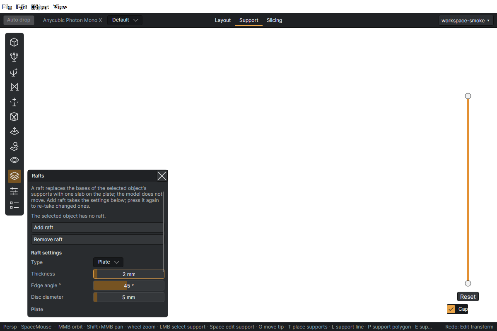

# Rafts

A raft joins the feet of an object's supports into a removable foundation. Open **Support → Rafts**, choose the target, set the dimensions, and press **Add raft**. It replaces individual bases for that object without moving the model; trunks continue through the raft to the plate.

**Add raft** takes a snapshot of the current settings. Press it again to apply changed values. **Remove raft** restores the ordinary base presentation/geometry for the supported object. Raft changes are undoable.

## Raft settings

| Setting | What it does |
| --- | --- |
| Type | Plate: one filled shape following the silhouette of the feet. Web: a disc under each foot, joined to its neighbours by flat bars. |
| Thickness | Height of the raft on the plate, mm. Every trunk runs through it to the plate. |
| Edge angle ° | The scraper lip on the raft's outside: the top overhangs the plate footprint at this angle from vertical, so a scraper slides under it. 90 = no lip. |
| Disc diameter | The disc under each foot (Web), and each foot's footprint in the Plate silhouette, mm. |
| Margin | How far the plate extends beyond the outermost feet, mm. |
| Bridging distance | The widest gap between feet that the plate fills in, mm; a wider gap stays a notch in the outline. |
| Bar width | Width of the flat bars between neighbouring feet, mm. |
| Max bar length | Bars longer than this are not laid, mm. 0 = no limit. |

## Plate or web?

**Plate** fills an outline around the feet. Margin grows its outer edge; bridging distance decides which gaps fill in and which remain notches.

**Web** puts a disc under each foot and connects neighbouring discs with flat bars. Bar width determines strip width; maximum bar length leaves distant feet disconnected. Zero maximum bar length means unlimited, not no bars.

The **edge angle** controls the outward scraper lip: the top overhangs the plate footprint. The UI defines 90° as no lip. Thickness and lip size affect geometry and material, so inspect the first slice layers after changing them.

The **Rafts** visibility switch only hides the viewport drawing; use **Remove raft** to remove it from the print.
