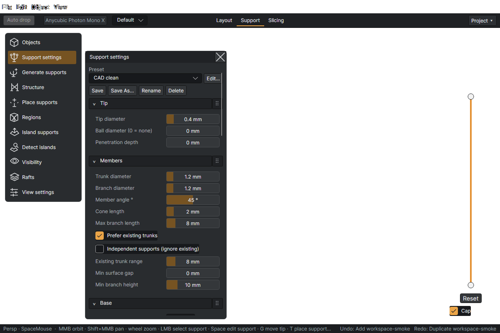

# Support settings

Open **Support → Support settings**. Choose the target model in **Objects** before generation or editing. **Generate supports** (`Ctrl+G`, Support) creates contacts and routes them into printable members; status messages report refusals and unplaced contacts.

## Presets and applying changes

- The preset selector loads a named snapshot of the support settings.
- **Save** overwrites the selected preset; **Save As…** creates one; **Rename** and **Delete** manage the list.
- **Edit…** opens the preset editor with sample selection, a support display selector, and a live 3D preview. Inspect routed/refused counts as well as appearance, then **Save** or **Cancel**.
- Changing settings does not automatically rebuild every existing support. The Structure preview applies changes to selected supports, or all of the target's supports when none are selected; **Apply** commits and **Cancel** discards the preview.
- Rafts take a settings snapshot when **Add raft** runs; run it again to apply changed raft settings.

Lengths below are mm. Defaults are starting values, not a resin calibration.

## Tip

| Setting | What it does |
| --- | --- |
| Tip diameter | Diameter of the tip's end where it meets the model, mm. Smaller leaves a smaller mark and holds less. |
| Ball diameter (0 = none) | A sphere at the very tip, mm, for a rounder contact that snaps off cleanly. 0 = the cone ends flat. |
| Penetration depth | How far the tip sinks into the model surface along its axis, mm, so the contact bonds rather than touches. |

## Members

| Setting | What it does |
| --- | --- |
| Trunk diameter | Diameter of the vertical member rising from the base, mm. |
| Branch diameter | Diameter of the angled members that carry tips to a trunk, mm. |
| Member angle ° | Maximum lean from vertical for model-contact tips and branches. T placements on existing supports use a fixed 45° tip and outward branch. |
| Cone length | Length of the cone from the tip's end back to where it joins its branch or trunk, mm. |
| Max branch length | Maximum branch length, mm. Also limits the outward branch when T-placing on an existing support; placement is refused if this cannot reach a clear trunk position. |
| Prefer existing trunks | Try branching onto nearby existing trunks before creating new ones. |
| Independent supports (ignore existing) | T placements on models ignore other supports but still avoid models. Placements on existing supports always check clearance. |
| Existing trunk range | How far around a new tip the router looks for a trunk already standing to branch onto, mm. |
| Min surface gap | Minimum gap between the surfaces of members that do not meet, mm, so neighbours do not fuse. 0 = no rule. |
| Min branch height | No branch joins a trunk, and no junction is made, below this height above the plate |

## Base

| Setting | What it does |
| --- | --- |
| Shape | Disc: a flat disc on the plate. Disc + cone: the disc with a cone up to the trunk. None: the trunk ends on the plate. |
| Base diameter | Diameter of the base disc on the plate, mm. Bases never shrink to fit; a base that would hit the model moves instead. |
| Base height | Height of the base disc, mm. |
| Base cone height | Height of the cone from the disc up to the trunk diameter (Disc + cone), mm. |

## Grid

| Setting | What it does |
| --- | --- |
| Use base grid | Snap support bases to a regular grid; disable for free base placement. |
| Grid pitch | Spacing of the imaginary grid bases snap to, mm. Coarser gives a tidier forest, finer reaches more tips. |

## Reinforce

| Setting | What it does |
| --- | --- |
| Enable reinforcement | Add extra contacts around the chosen seed using the ring settings below. |
| Seed selector | Where the reinforcing ring is centred: the lowest point of the object, or of each island. |
| Ring tip count | How many extra tips the ring places around the seed. |
| Ring radius | Radius of the ring of extra tips around the seed, mm. |
| Tip diameter multiplier | The ring's tips use the tip diameter times this: heavier tips where the print starts. |

## Guided

| Setting | What it does |
| --- | --- |
| Guided tools ignore existing | Guided tools place every tip and route as if no other support existed. Untick to keep clear of existing tips and route around existing supports. |
| Guided tip clearance | When guided tools respect existing supports: no guided tip closer than this to an existing tip |
| Densify: tips per gap | D inserts this many tips along the surface between each pair of neighbouring selected tips (all of the model's tips when nothing is selected) |
| Thin: keep 1 in | Shift+D keeps one tip in this many along each run of selected tips and removes the rest with their supports |

## Structure

See [Parenting and bracing](Parenting-and-bracing.md) for its complete settings reference.

## Placement

| Setting | What it does |
| --- | --- |
| Spacing | Distance between neighbouring tips on an overhang, mm. Closer holds better and marks more. |
| Island spacing | Tip spacing inside an island, mm; islands start the print off the plate, so they get denser tips than an ordinary overhang. |
| Painted row pitch (Z) | Row pitch in Z for a painted region, mm: rows are what matters most on a wall. |
| Painted row spacing | Spacing along each painted row, measured along the surface, mm. |
| Overhang angle ° | Faces that lean down more than this from vertical get supports, degrees. 0 is a wall, 90 a flat underside. |
| Min island area mm² | An island smaller than this is ignored, mm². Below the minimum a region does not carry the layer above it. |
| Max angle from down ° | A contact is only placed on a face within this angle of straight down, degrees. 90 = every downward face. |
| Require line of sight to plate | Require an unobstructed straight-down path from the contact to the plate. |

## Choosing values

Start with the preset nearest your model's needs. Smaller tips make smaller contact marks but carry less load. Smaller spacing adds contacts; larger member and base dimensions increase material and rigidity. A tighter angle, reach, or clearance limit can make routing impossible, so check refusals after changing these controls.

The generation **Overhang angle** is measured from vertical (wall = 0°, flat underside = 90°). **Max angle from down** is measured from straight down (flat underside = 0°). They are different filters. Viewport overhang tint has a separate display threshold in Preferences.

Next: [Guided placement](Manual-and-guided-supports.md) · [Regions and islands](Regions-and-islands.md) · [Parenting and bracing](Parenting-and-bracing.md)
